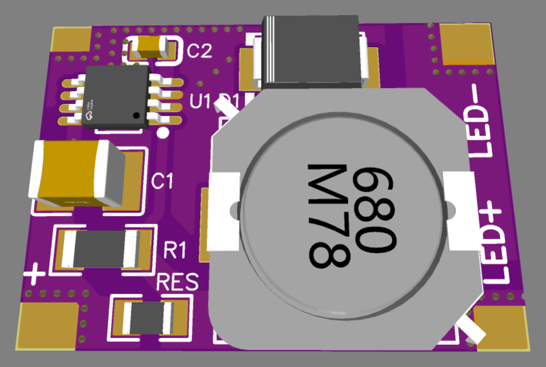
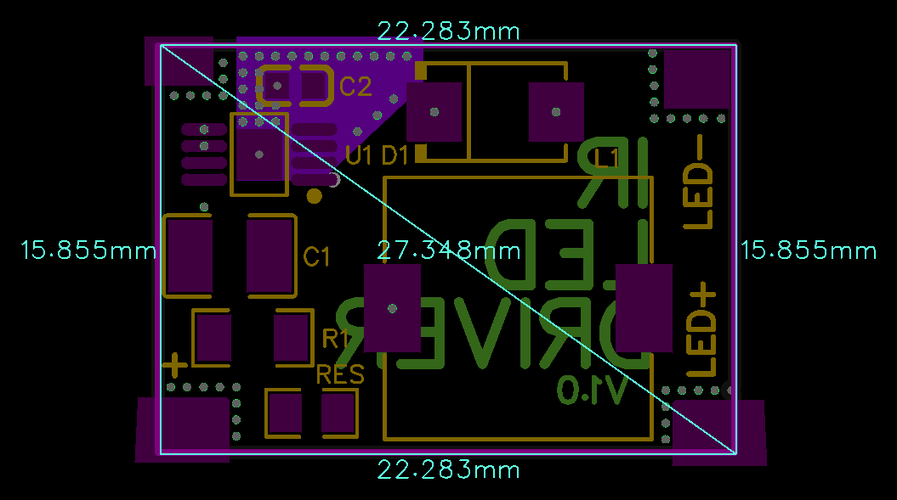

# LEDdriver

> High-Power 4.5–25V / 0.1–1.0A Step-Down (Buck) Constant-Current LED Driver for IR illuminators, night-vision floodlights, and high-intensity emitter arrays.

[-2da44e?style=for-the-badge)](#)

  
  

---

### ⚡ Electrical Specifications & Power Features

* **🔋 Operating Input Voltage (`VIN`)**:
  * **Wide Supply Range**: **4.5 VDC to 25.0 VDC**.
* **〰️ Constant Output Current Range**:
  * **Configurable Range**: **0.1 A (100 mA) to 1.0 A (1000 mA)**.
  * Precise current regulation set via onboard shunt resistors (**`R1` / `RES`**).
* **📉 Voltage Differential (Headroom) Requirement**:
  * **$\Delta V \ge 1.0\text{–}1.5\text{ V}$**: Input supply voltage must always exceed the total forward voltage ($V_f$) of the connected LED load by at least **1.0 to 1.5 V** to ensure stable constant-current regulation without ripple or dropout.
* **📏 Dimensions**:
  * Compact footprint of **`22.3 × 15.8 mm`** (exact CAD: `22.283 × 15.855 mm`, diagonal `27.348 mm`).

---