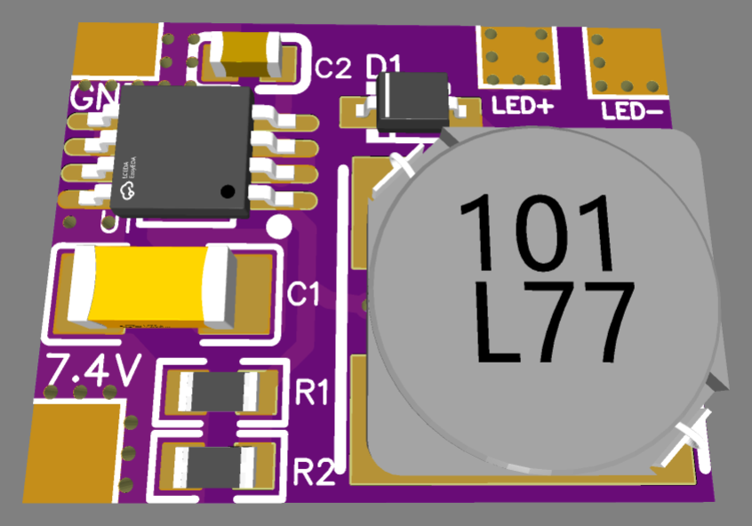
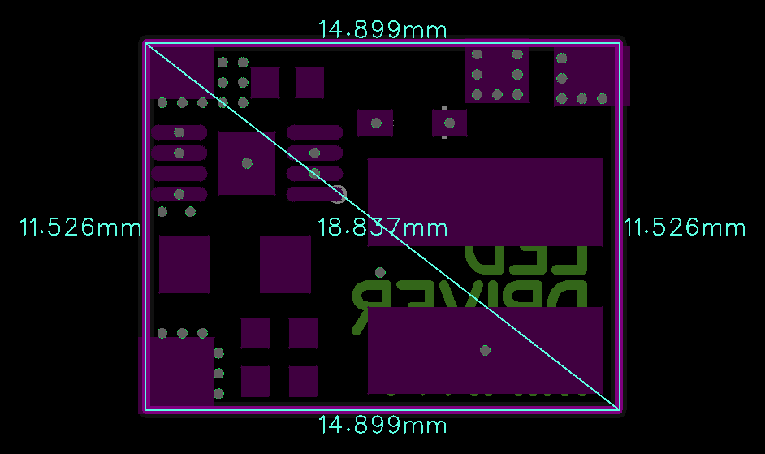

# LEDdriverMINI

> Ultra-compact 4.5–25V Step-Down (Buck) Constant-Current LED Driver (10–400 mA) for low-power LED illumination, IR backlights, and camera indicators.

  
  

---

### ⚡ Electrical Specifications & Power Features

* **🔋 Operating Input Voltage (`VIN`)**:
  * **Full Regulation Range**: **4.5 VDC to 25.0 VDC**.
* **〰️ Constant Output Current**:
  * **Configurable Range**: Fixed output current from **10 mA to 400 mA** (set via onboard precision resistors R1 / R2).
* **🎯 Target Applications**:
  * Low-power LED lighting, camera IR illuminators, machine vision backlights, and portable equipment indicators.
* **📏 Dimensions**:
  * Ultra-compact board size of **`14.9 × 11.5 mm`** .

---

### ⚙️ Operating Guidelines

* **Buck Voltage Headroom**: As a step-down (buck) topology, the input supply voltage must be higher than the total forward voltage ($V_f$) of the connected LED load.
* **Current Programming**: Current is precisely governed by the onboard shunt resistors R1 and R2.