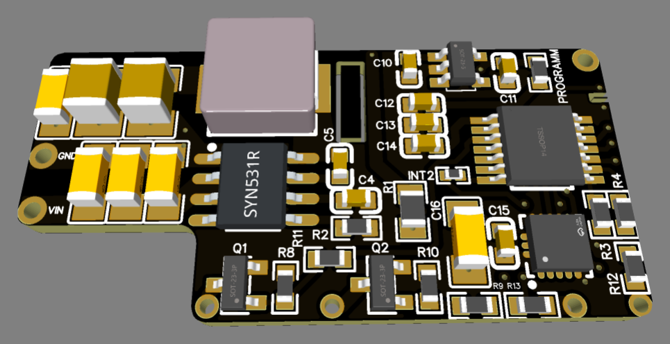
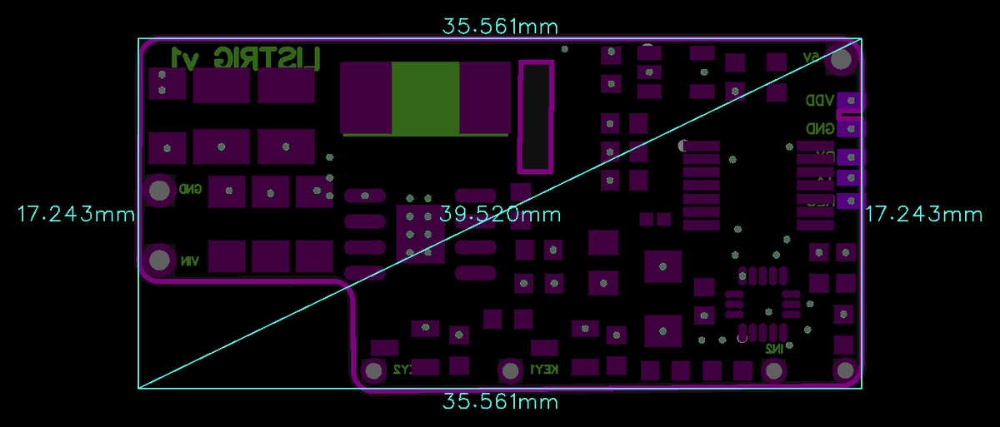

# LISv1

> Intelligent Wide-Input (5.35–36V) to 5V/3A Power Switching Module with Precision MEMS Micro-Motion & Vibration Detection.

  
  

---

### ⚡ Electrical Specifications & Power Features

* **🔌 Wide Input Voltage Range (`VIN`)**:
  * **Operational Supply Window**: **5.35 VDC to 36.0 VDC**.
* **⚡ Regulated Switched Output (`5V`)**:
  * **Output Voltage**: Stabilized **5.0 VDC**.
  * **Continuous Load Current**: Up to **2.8 A**.
* **📳 Integrated Micro-Motion & Vibration Detection**:
  * 3-axis MEMS accelerometer detects micro-movements and wakes up the main MCU for processing.
* **🧠 Intelligent Controller**:
  * Onboard MCU executes smart signal filtering to prevent false triggers and manages hold-on timers.
* **📏 Form Factor**:
  * Compact notched PCB measuring **`35.6 × 17.2 mm`**.

---

### ⚙️ Operating Logic & Typical Applications

* **Automated Wake-On-Motion**:
  * While stationary, the board remains in a low-power sensing state.
  * Upon detecting micro-movement or physical vibration, the synchronous converter energizes the 5.0V load output.
* **Programmable Run Timer**:
  * Keeps the load energized for a calibrated hold time after movement ceases, ensuring continuous operation during temporary pauses.

