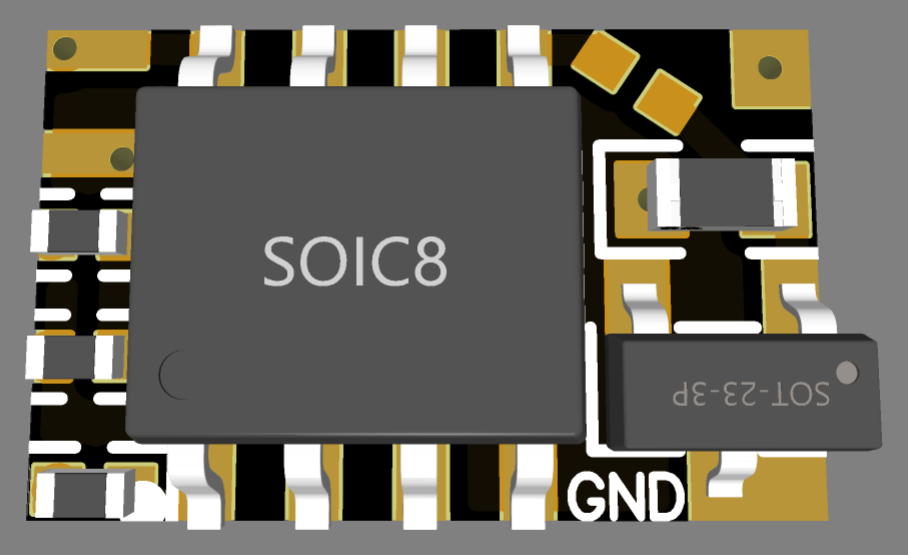
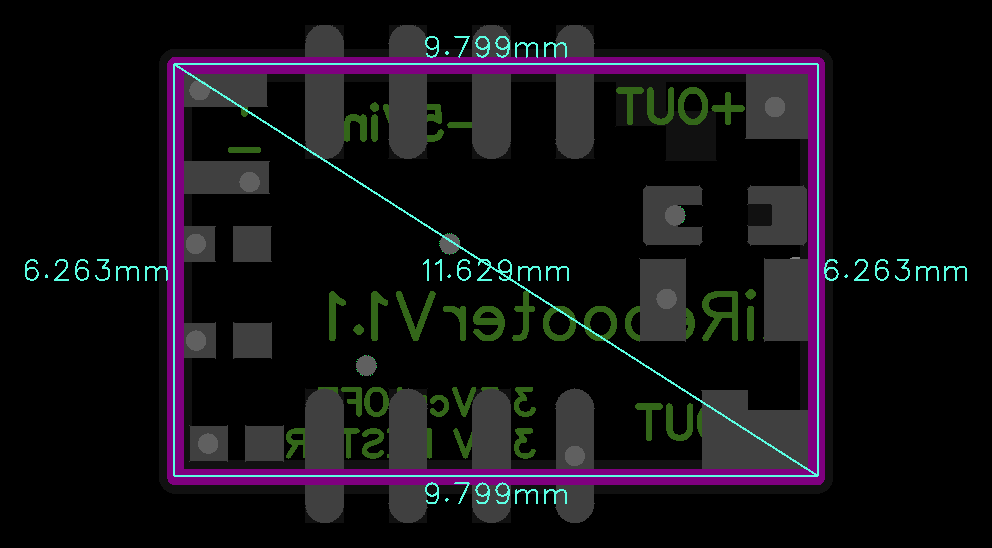

# LiRebooterV1.1

> Ultra-miniature 1S Li-Ion battery monitoring and power management board with 10-hour cyclic reboot, under-voltage cutoff, and 5A continuous output capability.

  
  

---

### ⚡ Electrical Specifications & Battery Protection

* **🔋 Target Battery Architecture**:
  * Designed for **1S Li-Ion / Li-Po** battery cells.
  * **Output Voltage**: Direct battery voltage pass-through to load.
* **⚡ Continuous Load Capacity**:
  * **Maximum Continuous Current**: Up to **5.0 A**.
* **🛡️ Under-Voltage Discharge Protection**:
  * **Cutoff Voltage**: Output disconnects automatically when battery voltage falls below **3.5 V** to prevent over-discharge and cell degradation.
  * **Hysteresis Auto-Recovery**: Operation resumes automatically once battery voltage recovers to **3.9 V** (upon recharging).
* **📏 Form Factor**:
  * Ultra-compact miniature footprint measuring **`9.8 × 6.3 mm`**.

---

### ⚙️ Operating Logic & Timers

* **Startup Delay**:
  * **10-Second Delay**: Power stabilization delay on initial power-on before enabling load output.
* **Autonomous 10-Hour Cyclic Reboot**:
  * Automatically power-cycles the connected load every **10 hours** to clear potential device freezes and preserve system autonomy.