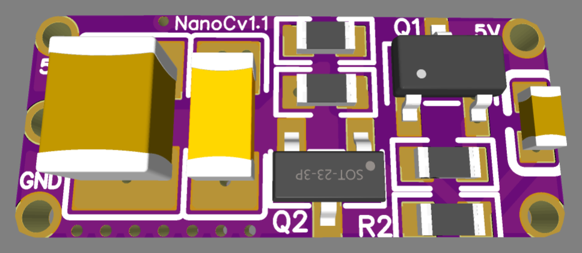
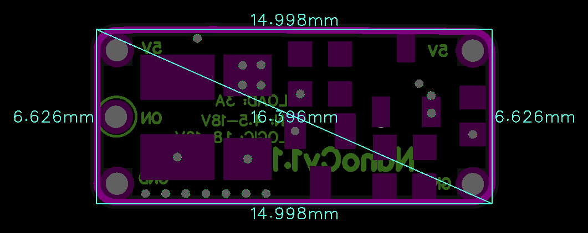

# NanoCv1.1

> Ultra-compact 4.5–18V / 3A Level-Shifted Power Switch with wide 1.8–10V logic control and integrated 20ms soft-start inrush protection.

  
  

---

### ⚡ Electrical Specifications & Power Features

* **🔋 Switched Input Voltage (`IN`)**:
  * **Wide Range**: **4.5 VDC to 18 VDC**.
* **🎛️ Logic Control Input (`LOGIC` / `ON`)**:
  * **Broad Logic Level**: **1.8 VDC to 10 VDC** (direct MOSFET gate connection via onboard resistor).
* **〰️ Maximum Continuous Load Current**:
  * Up to **3.0 A** continuous load current.
* **🛡️ Inrush Current Protection**:
  * **Soft Start (20 ms)** 
* **📏 Compact Form Factor**:
  * Ultra-small footprint measuring just **`15.0 × 6.6 mm`**.

---

### ⚙️ Operating Logic & Level Shifting

* **Level-Shifted Power Switching**:
  * Controls loads up to 18V directly from low-voltage logic (1.8V–10V).
* **Direct Logic Interface**:
  * Connects directly to MCU GPIO without external driver circuitry.

