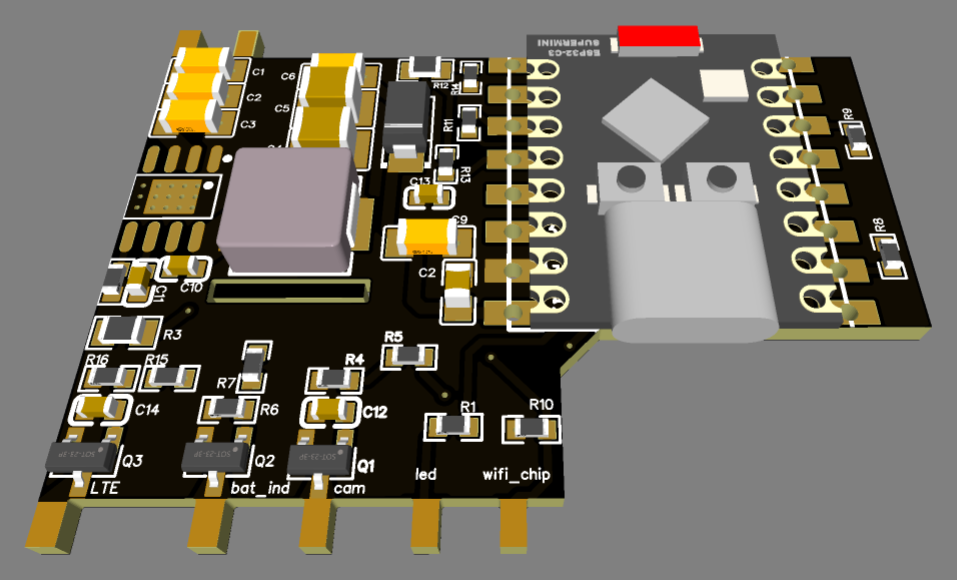
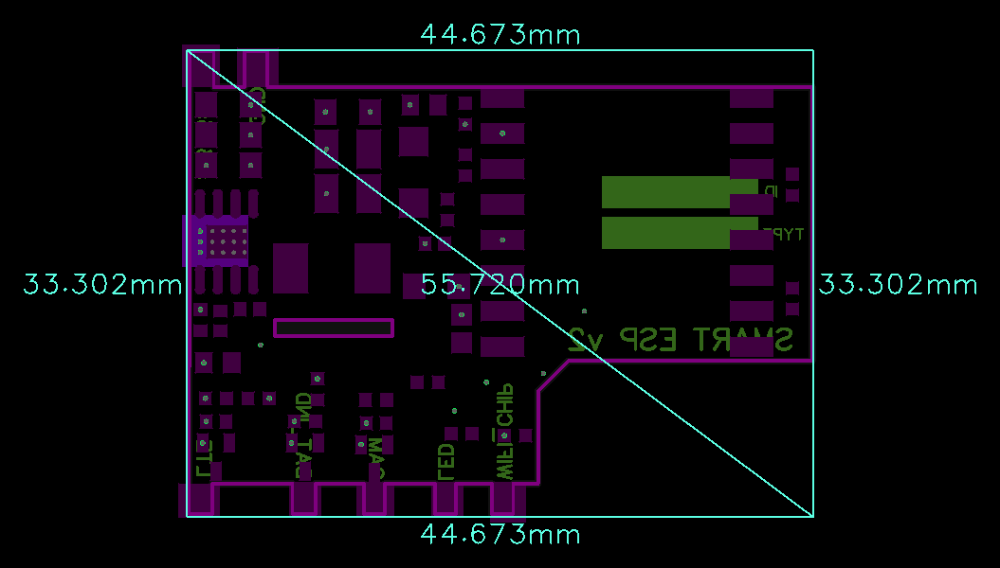

# SmartESPmonitor

> Intelligent power expansion and battery monitoring carrier board for ESP32-C3 SuperMini with 5.45–36V input, 5V/2.5A power step-down, multi-channel load switching, and battery ADC monitoring.

  
  

---

### ⚡ Electrical Specifications & Power Features

* **🔌 Wide Input Voltage Range (`VIN`)**:
  * **Operational Supply Window**: **5.45 VDC to 36.0 VDC**.
* **⚡ High-Efficiency 5V Power Conversion**:
  * Integrated Step-Down Buck regulator providing stabilized **5.0 VDC**.
  * **Continuous Operating Current**: Up to **2.5 A** continuous load current.
* **🔋 Battery Monitoring**:
  * Integrated voltage divider for battery measurement via ADC.
* **🔀 Integrated Control MOSFETs**:
  * Onboard MOSFET switches for load and peripheral control.
* **💡 External Status Indication**:
  * Dedicated outputs for external status indicators.
* **📏 Dimensions**:
  * **`44.6 × 33.3 mm`**.

---
